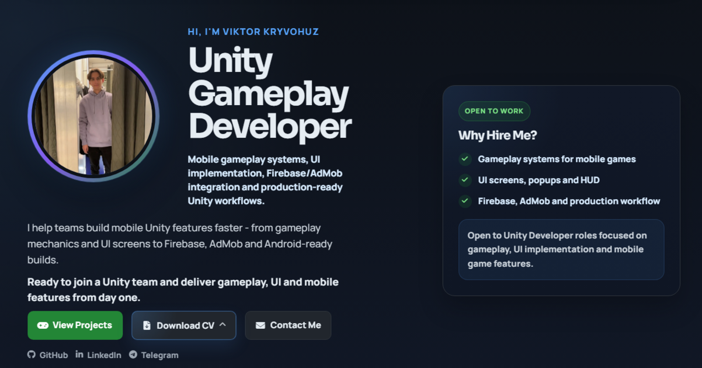

 

  

Unity Developer focused on mobile games, gameplay systems, UI implementation, localization and mobile optimization.

Based in Dublin, Ireland.

 

  

---

# Portfolio Preview

---

# About Me

Unity Developer focused on building mobile game features that are clear, maintainable and ready for real project workflows.

I work with gameplay systems, UI flow, mobile optimization, Firebase/AdMob features, localization and Android-ready Unity builds.

My portfolio includes several Unity projects, from small gameplay prototypes to more complete mobile game case studies with progression, save systems, AI, procedural generation and production-style architecture.

### Main Focus

- Gameplay systems for mobile games
- UI screens, popups and HUD implementation
- Firebase, AdMob and Android-ready builds
- Localization and multilingual UI support
- Clean architecture and reusable Unity systems
- Git-based production workflows

---

# Tech Stack

---

# Featured Projects

## 🎮 Rushline

**3D Endless Runner** with swipe controls, procedural obstacles, Firebase authentication, leaderboard flow, Zenject architecture, rewarded ads and state-machine gameplay.

### Implemented

- Core endless runner gameplay loop
- Swipe-based player controls
- Procedural obstacle generation
- State-machine gameplay flow
- Firebase authentication and leaderboard flow
- AdMob rewarded ads integration
- Mobile UI, HUD and optimization-focused structure

🔗 **Repository**  
https://github.com/dkameroon/Rushline

🌐 **Portfolio Page**  
https://dkameroon.github.io/pages/rushline.html

---

## 🚗 Car Repair Shop

**3D Idle Tycoon** with AI mechanics, crafting, upgrades, inventory management, progression systems and JSON-based save logic.

### Implemented

- AI-controlled mechanics and worker behavior
- NavMesh-based movement logic
- Inventory and crafting-related gameplay systems
- Economy, upgrades and progression flow
- JSON save system
- ScriptableObject-based configuration
- Mobile-friendly UI implementation

🔗 **Repository**  
https://github.com/dkameroon/CarRepairShop

🌐 **Portfolio Page**  
https://dkameroon.github.io/pages/carrepairshop.html

---

## 🧩 Vertex Puzzle

**Logic Puzzle Game** where the player connects vertices and completes all paths under time pressure.

### Implemented

- Vertex-connection puzzle gameplay
- Path completion logic
- Timer-based challenge flow
- LineRenderer-based visual connection system
- Progress persistence with PlayerPrefs
- Mobile-friendly UX and UI flow

🔗 **Repository**  
https://github.com/dkameroon/VertexPuzzle

🌐 **Portfolio Page**  
https://dkameroon.github.io/pages/vertexpuzzle.html

---

## ⛳ Golf

**Arcade Mini Golf** with swipe controls, physics-based shot mechanics, level progression and star rating system.

### Implemented

- Physics-based golf shot system
- Swipe input controls
- Level progression flow
- Star rating system
- PlayerPrefs-based progress storage
- Mobile UI and gameplay flow

🔗 **Repository**  
https://github.com/dkameroon/GOLF

🌐 **Portfolio Page**  
https://dkameroon.github.io/pages/golf.html

---

## 🏃 SimpleRunner

**2.5D Endless Runner** with obstacle avoidance, coin collection and increasing game speed.

### Implemented

- 2.5D endless runner gameplay loop
- Obstacle avoidance logic
- Coin collection system
- Increasing game speed and difficulty
- Collision-based gameplay events
- Android-ready mobile build support
- PlayerPrefs-based progress storage

🔗 **Repository**  
https://github.com/dkameroon/SimpleRunner

🌐 **Portfolio Page**  
https://dkameroon.github.io/pages/simplerunner.html

---

# Current Interests

- Mobile game architecture
- Gameplay systems design
- Production-ready Unity workflows
- UI / UX implementation
- Localization pipelines
- Firebase / AdMob integration
- Optimization for mobile platforms

---

# Contact

### Let's Connect

<a href="mailto:kvv200328@gmail.com">Email</a> •
<a href="https://t.me/VITON_28">Telegram</a> •
<a href="https://www.linkedin.com/in/viktor-kryvohuz">LinkedIn</a> •
<a href="https://dkameroon.github.io">Portfolio</a>

 

📍 Dublin, Ireland

   

